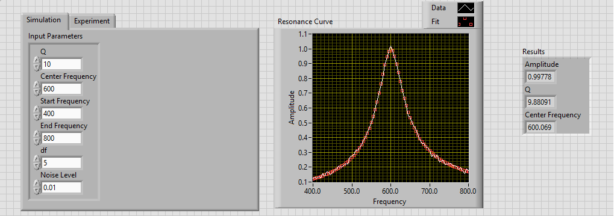
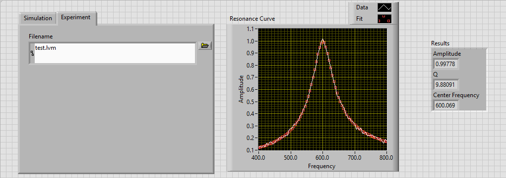

In this exercise, you will write an extension VI that analyzes one of the measured resonance curves of [Kundt's Tube](http://en.wikipedia.org/wiki/Kundt's_tube). Create this VI inside of your Kundt's tube project and name it ResonanceAnalyzer.

This VI should have two parts: simulation and experiment.

0) Simulation part creates simulated data for an acoustic resonance curve for given parameters. You need to come up with functional form of the resonance curve. After simulating data, add Gaussian noise centered around zero with sigma defined as noise level.

1) Experiment part reads data from a spreadsheet that you saved from your experiments the week before for a single resonance curve. If you haven't taken data yet, select a peak and take detailed data of that single peak. 

After you are finished with creating synthetic data or loading data, your VI should do curve fitting on data. This curve fitting should be non-linear and it should give real parameters for experimental data. For synthetic data, you should get very close parameters to input parameters.

After you analyze the experimental data, make your results default from edit menu and save your project.
